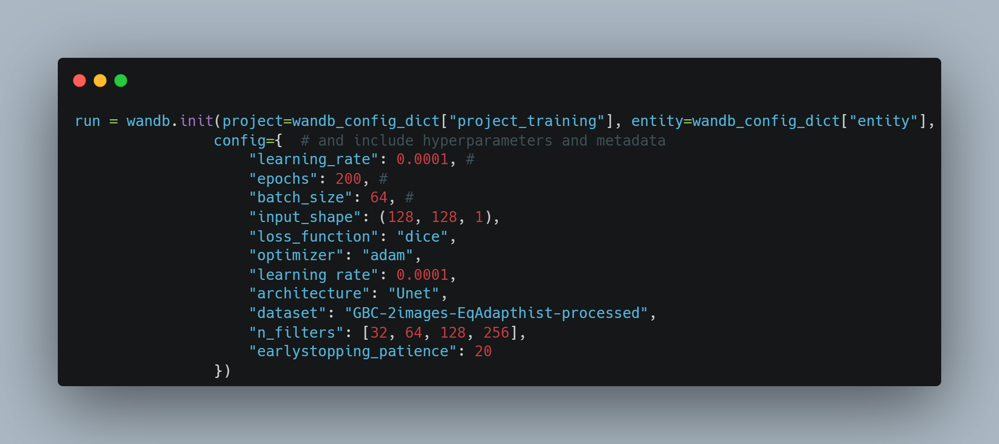

**Trains Deep Neural Networks for the task of semantic segmentation of microglial cell**

# Usage
The project contains different scripts for training neural network architectures in the task of semantic segmentation. Weights&biases is used to load data and log the training results. A .json file is used to configure every run. I have included an "example" .json, you have to put the values corresponding to your wandb profile and projects. 

The only script the user is supposed to run is *train_models.py*. All the other scripts are called by it in the background to load data/models. You can also modify/add the files inside *Model_classes*. Every file contains the definition of a class (e.g. *unet_class.py* contains a Unet), the parameters used to configure the neural network (e.g. Number of filters, activation function etc.) and the parameters to configure the training run (e.g. number of epochs, learning rate, earlystopping patience etc.). 

You will need to specify the *class* script you intend to use inside the .json file. I've put the path to the *unet_class.py* in the .json example I'm providing.

After each successful run, you will find an image in the *Predicted_images* folder. The image is a 4-colour plot, where each colour corresponds to an element of the confusion matrix (TN=blue, TP=green, FN=yellow, FP=red). You will also find all the important metrics (precision, recall, f1) logged on your wandb profile. 

# Citation (BibTeX)
If you use this software, please cite it as below.

@software{Ggragnaniello_microglia_ss2022,
  author = {Gragnaniello, Gianluca},  
  month = {12},  
  title = {{Deep NN for microglial semantic segmentation}},  
  url = {https://github.com/Gianluca-G98/Train_microglial_models},  
  version = {1.0},  
  year = {2022}  
}

In the "Citation.bib" you can find a list of the papers I read to produced the models and a citation to wandb.